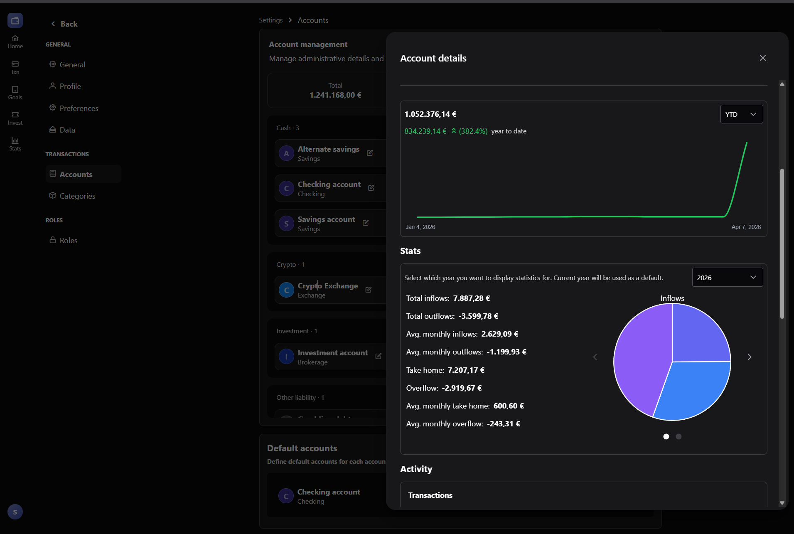

# Wealth Warden

An open-source finance tracker focused on simplicity and usability.

## About

Wealth Warden started as a personal Excel spreadsheet for tracking finances.
After years of manual updates and growing complexity, it evolved into a web application that maintains the simplicity of spreadsheet-based tracking,
while adding the power of automation and visualization.

## Hosting

The app is already working and can currently only be self-hosted with [Docker](./docs/docker.md).

## Notes

This project is still in development, there are things I want to implement that are currently on hold.
Since the app is data heavy, some performance issues may arise.

There are also some features that are implemented half way, those being:
  - **Currencies**: For now, EUR is the default and can not be changed
    - USD is supported for investments
  - **Timezones**: Limited support
  - **Permissions**: Limited support

## Local development

The instructions below are for anyone that wants to run the app locally.

### Requirements
- Go > 1.25
- Node > 20
- PostgreSQL > 14

### Getting started

Edit configuration files
- `.pkg/config/override/dev.yaml`
- `./client/.env`

By default, the app will be available at http://localhost:5000
