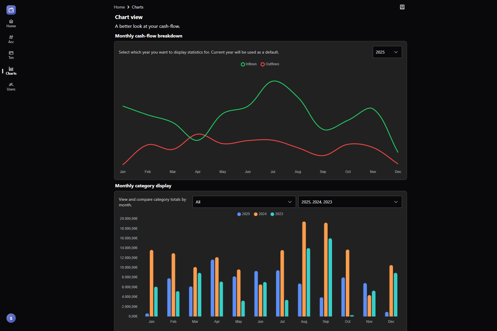

# Wealth Warden

An open-source finance tracker focused on simplicity and usability.

## About

Wealth Warden started as a personal Excel spreadsheet for tracking finances. 
After years of manual updates and growing complexity, it evolved into a web application that maintains the simplicity of spreadsheet-based tracking, 
while adding the power of automation and visualization.

It's written in Go and Vue, and can be deployed with Docker easily.

### Dashboard page


### Charts view


### Investment management


## Notes
- This project is still a work in progress, there are things I want to implement that are currently on hold
- There are also some features that are implemented half way, those being:
  - Currency support: For now, EUR is the default and can not be changed
    - USD is supported for investments
  - Timezone support: Not supported everywhere
  - Permissions: Implemented in a basic way

## Features:
- Ledger based transactions tracking across multiple accounts with automatic balance calculations
- Daily, monthly, and yearly statistics to monitor your financial health
  - Compare performance across different time periods
- Interactive Charts & Visualizations
- Per-record audit trails on individual records, showing the complete history of changes with timestamps and events
- Investment portfolio management
  - Track stocks, ETFs, and cryptocurrencies with real-time price updates from Yahoo Finance API
  - Monitor individual trades with P&L calculations
  - Linked investment accounts integrated with the main ledger system
- Automation & Scheduled Jobs
  - Automatic asset price updates for real-time investment tracking
  - Balance backfill job to maintain accurate historical data
  - Execute recurring transactions based on your configured parameters via transaction templates

## Deployment

It's recommended to run the app with Docker. Instructions can be found [here](./docs/docker.md)

### Local development

If you want to add changes to the app, you can run it locally.
You need to setup:
- A Postgres instance
- Have Go installed
- Have npm installed

#### Running the server
You can run the server with the following command:
```shell
go run ./cmd/http-server
```

Alternatively, you can use the provided Makefile.
```shell
make run | migrate {type} | seed
```

### Environment
The app uses a `dev.yaml` file, located in `/pkg/config/override/`
- An example for docker is provided in `/pkg/config/dev.docker.yaml` which is an unsecure dummy config for docker builds.

#### Running the client

Change into the correct directory:
```shell
cd ./client
```

Install packages with npm:
```shell
npm install
```

Run the client
```shell
npm run dev
```
