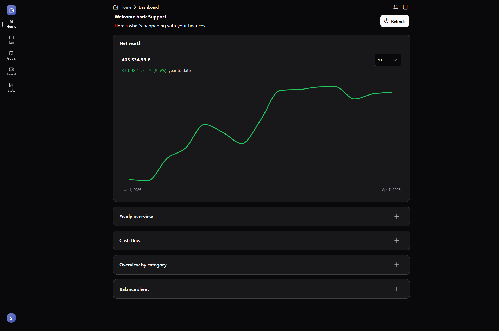
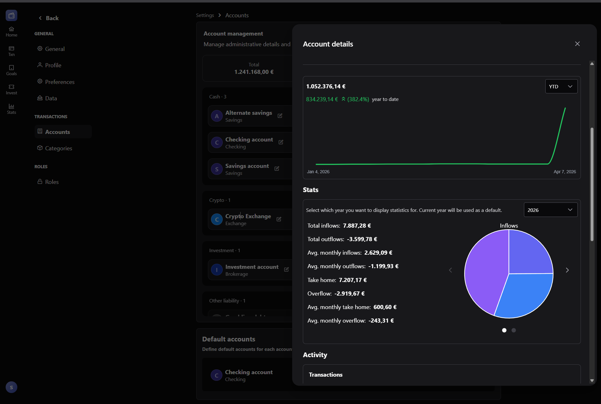
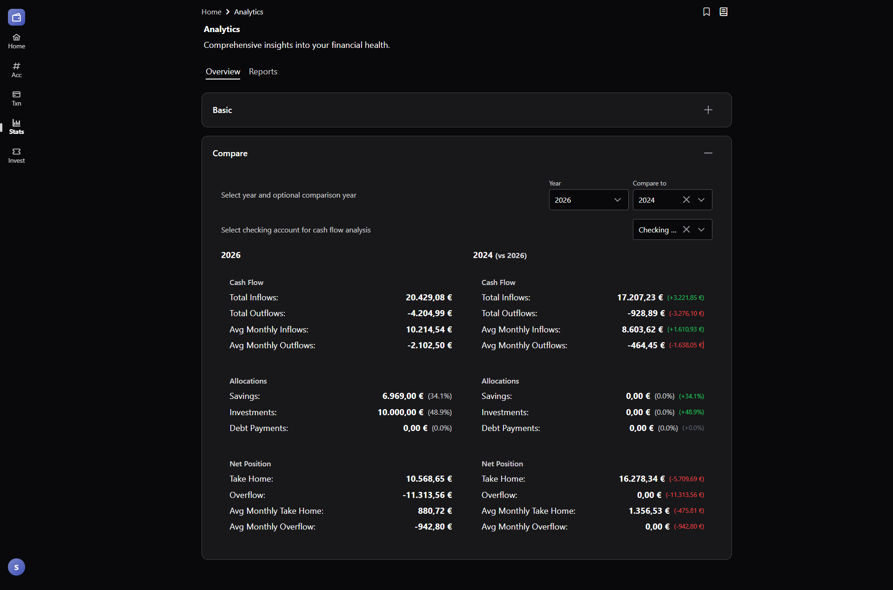
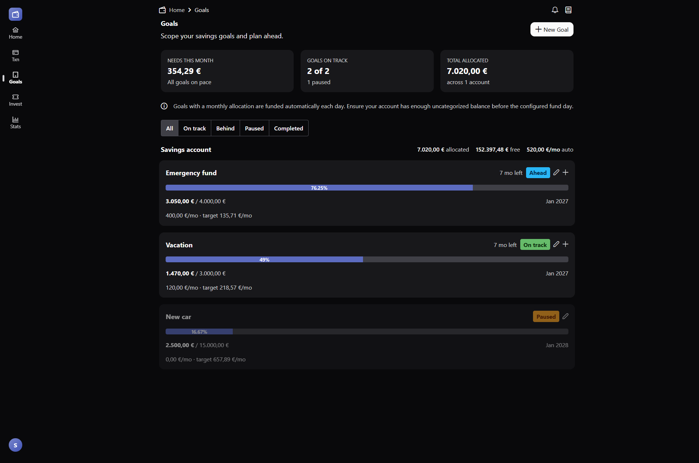
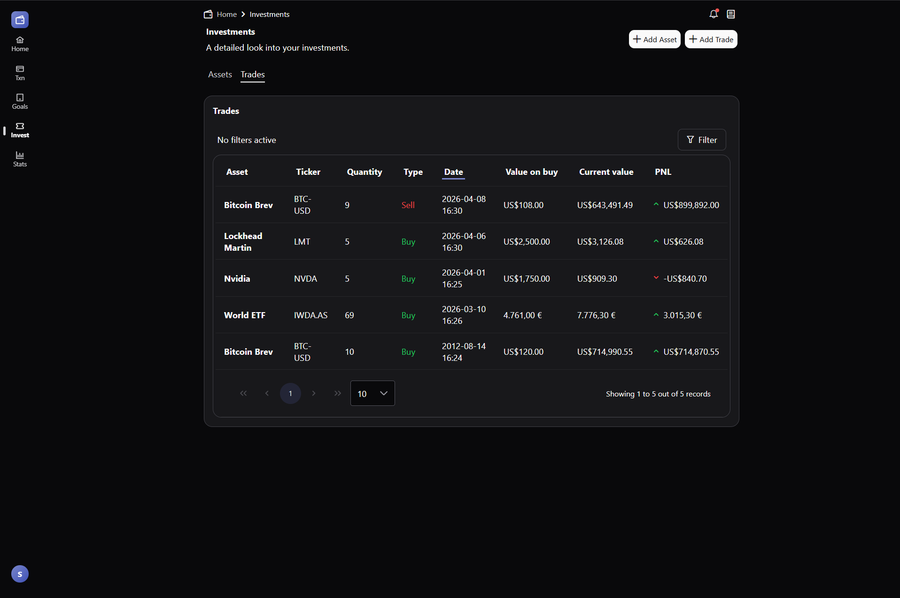

# Wealth Warden

An open-source personal finance tracker focused on simplicity and usability.                                                                                                                                                                                                                                        
Built as a self-hosted alternative, for people who want full control over their financial data.

<table>
  <tr>
    <td></td>
    <td></td>
  </tr>
  <tr>
    <td></td>
    <td></td>
  </tr>
</table>

## About

Wealth Warden started as a personal Excel spreadsheet for tracking finances.
After years of manual updates and growing complexity, it evolved into a web application that maintains the simplicity of spreadsheet-based tracking,
while adding the power of automation and visualization.

## Features

- **Transaction tracking** - income, expenses, and transfers across multiple accounts
- **Savings goals** - set targets with monthly allocations and automatic funding
- **Investment tracking** - stocks, ETFs, and crypto with live price sync
- **Analytics** - yearly cash flow, category breakdowns, and net worth over time
- **Automation** - recurring transaction templates on configurable schedules
- **Multi-currency** - per-user default currency with exchange rate caching
- **Notifications** - in-app alerts for automated job results and price movements

## Hosting

The app is already working and can currently only be self-hosted with [Docker](./docs/docker.md).

## Notes

This project is still in development, there are things I want to implement that are currently on hold.
Since the app is data heavy, some performance issues may arise.

There are also some features that are implemented half way, those being:
  - **Currencies**: Default currency is configurable per user. Exchange rates are fetched and cached for multi-currency investment accounts. Full multi-currency support across all accounts is not supported.
  - **Permissions**: Limited support

## Local development

The instructions below are for anyone that wants to run the app locally.

### Requirements
- Go > 1.26
- Node > 20
- PostgreSQL > 14

### Getting started

Edit configuration files
- `.pkg/config/override/dev.yaml`
- `./client/.env`

By default, the app will be available at http://localhost:5000
